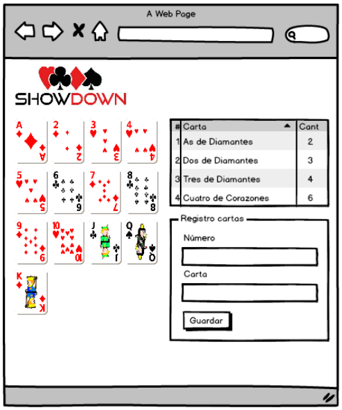
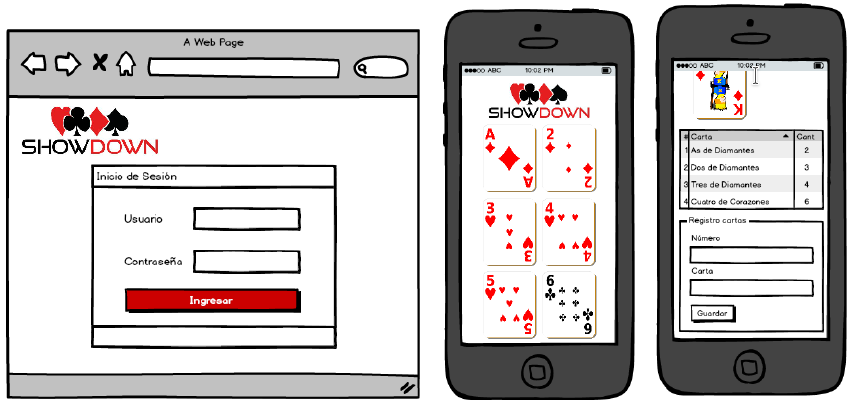

Se desea desarrollar una pagina (1.0) responsiva (0.6) para un juego sencillo
de cartas. Cada carta es un botón que permite hacer un incremento en el numero
de cartas. Para esto se debe contar con un array en Javascript almacenado en el
localStorage que contenga la información (Numero, Carta y Cantidad). La primera
carga de datos debe realizarse desde un archivo JSON (0.4) con una estructura
que se ajuste a la estructura anterior.

Adicional se debe contar con un formulario que permita adicionar elemento al
arreglo de Javascript (0.6). Este arreglo debe cargarse en la tabla lateral que
se observa, y esta tabla se debe modificar a medida que se realiza clic en cada
una de las cartas (1.0).  Ordenando de mayor a menor por la cantidad de cartas
(0,4) Formulario de login que envíe a la pagina anterior, que sea responsivo, y
que permita almacenar en el localStorage el nombre del usuario, solo si es
(usuario=admin, clave=1234) en caso de que sea otro se debe colocar un mensaje
de error y no enviar al formulario. (1.0) Utilizar algun framework o librería
es opcional.

